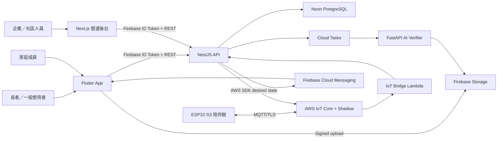
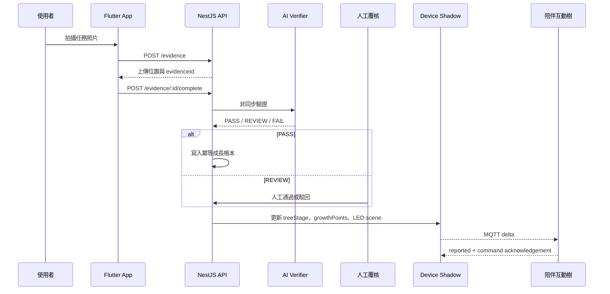

# 系統架構

## 架構目標

系統以長者與家庭的日常互動為第一場景，同時提供企業與社區管理端。
手機、硬體、AI 與 ESG 資料各自有清楚邊界，不讓任何一端直接修改成長
帳本或公益批次。

## 端到端任務流程

## 信任邊界

- App 與 Web 不直接連 PostgreSQL，也不能直接增加成長值。
- 成長值只能由完成任務或人工覆核的冪等帳本事件產生。
- ESP32 只可存取自己的 MQTT client、Shadow 與事件 topic。
- 照片上傳後移除 EXIF；AI 不做人臉辨識或敏感屬性推論。
- 公益批次第一版必須 `simulated=true`，公開頁永久顯示模擬標記。
- 裝置沒有相機與麥克風，只回傳按鍵、連線與環境感測資訊。

## 離線策略

- Flutter App 在 API 無法連線時進入清楚標示的示範模式。
- ESP32 以 LittleFS 保存最多 100 筆事件；重連後依序重播。
- 每筆事件包含穩定 `eventKey`，API 重複收到時只確認、不重複計分。
- Device Shadow 保存 desired/reported state，版本較舊的 delta 會被忽略。
