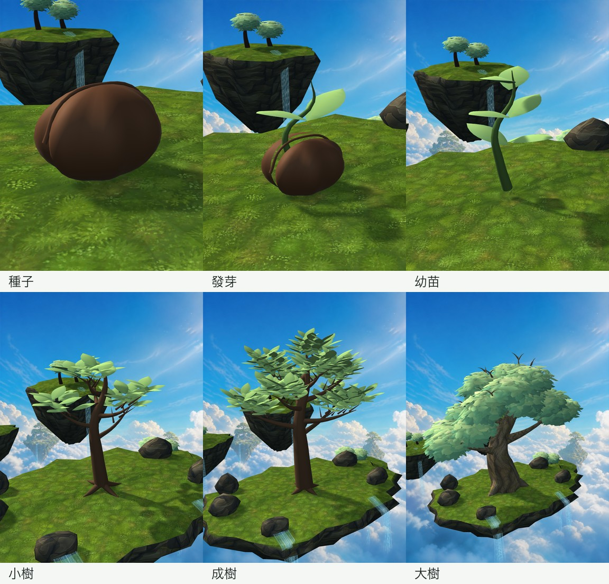
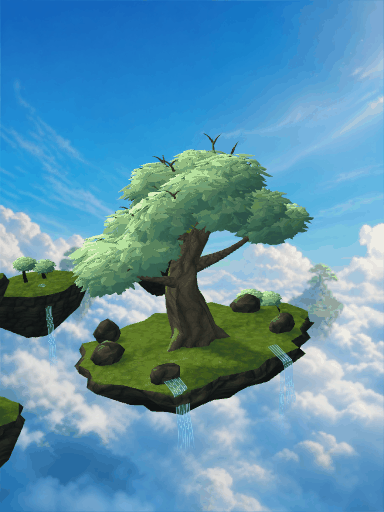

# 六階段與群島實景迭代

本頁保留早一輪進度。使用者後續已確認改為單島；最新造型與範圍見[單島世界樹造型試作](單島世界樹造型試作-2026-09-08.md)，不再追加中景群島。

## 方向與目前界線

採用 Blender 母稿 → FBX／GLB → Unity 的流程。使用者指定以先前提供的世界樹、天空群島、雲海和層疊瀑布圖作規模與構圖目標；人物、換裝和小遊戲仍不開工。

這一輪是可驗證的美術進度，不是最終世界樹品質驗收，也沒有宣稱已接進 Flutter App。遠景仍是既有原創背景圖片，不是完整三維雲海。程式測試不代表實機觸控與效能驗收。

## 本輪實作

- 新增五個可編輯早期造型：種子、發芽、幼苗、小樹、成樹。加上既有大樹，共六個造型。各階段共用座標原點，並非縮小同一棵樹。
- Unity 根據已驗證的階段資料切換獨立模型，移除成樹等比例縮放的早期階段替代方式。
- 五座真正的三維中景群島，帶有各自的小樹與瀑布；主島仍是視覺焦點。
- 主島瀑布由五列平面帶改成有上游與崖緣彎曲的網格，補上流向座標、下落加速的流紋、邊緣和末端透明消散。關閉重疊內光層，避免交錯條紋。
- 加入場景檢視控制：拖曳水平旋轉（左右各 70 度）、雙指縮放、雙點回正；電腦可拖曳、滾輪縮放、按 R 回正。這是有限角度的場景檢視，不是全世界自由漫遊。
- 旋轉與縮放不變更真實定位或成長資料；保留減少環境動態的偏好。

## 可重現檔案

- `tools/blender/build_growth_stages.py`：五個早期階段的可編輯造型生成流程。
- `tools/blender/build_life_tree.py`：大樹、主島、中景群島與水流幾何。
- `art-source/blender/生命樹生長階段_母稿.blend`、`生命樹庭園_母稿.blend`：可編輯母稿。
- Unity 選單「樹伴／輸出六階段生命樹實景」可產生十二張近景、浮島視角截圖。
- Unity 選單「樹伴／輸出浮島環繞展示」可產生九十張實際渲染影格。環繞展示由程式重現檢視控制，不冒充手機錄屏。

每格使用不同相機距離，方便檢查細節，並非同一比例尺。

## 驗證

- Unity 編輯器測試 14／14 通過，0 跳過。新增獨立生長網格、階段切換不縮放成樹、檢視角度與縮放限制及回正驗證。
- Blender 母稿、FBX、GLB 匯出成功；主島與中景世界共 69,570 三角面，不含另外載入的早期階段資產。面數是資產統計，不是手機效能保證。
- 環繞展示來自九十張 Unity 渲染影格，檢查不是靜止畫面後整理為四十五張 GIF 影格。
- 未完成手機觸控、App 內嵌及連續生長過渡驗收。

## 尚待完成的品質工作

1. 五段連續生長過渡動畫：本輪只有模型切換，不冒充已完成生長動畫。
2. 小樹與成樹的枝幹交接、葉冠層次及種殼質感仍需精修；幼年階段需要專屬預設取景。
3. 主島尚偏平，仍需溪流源頭、更多地表高差與能引導視線的植被分布。
4. 群島的遠近比例、遮擋與空氣透視需要再次構圖；雲海尚不是可自由環繞的體積效果。
5. 瀑布仍需近距離和動態檢查、水霧收尾，不能把流紋改善等同於水景完成。
6. 正式介面需要簡潔可見的回正／縮放替代按鈕，不能只靠隱藏手勢。人物仍延後。
7. 場景完成後，再驗證 App 串接、手機實際触控、幀率、記憶體與發熱。

## 視覺參考

查閱日期：2026-09-08。參考構圖、層次與規模，沒有下載或挪用其模型／貼圖。

- 使用者提供的世界樹群島圖片；搜尋亦找到相近的[《世界樹的迷宮 X》構圖報導](https://gnn.gamer.com.tw/detail.php?sn=165509)。
- [Lily 的浮島作品](https://sketchfab.com/3d-models/ghibli-inspired-floating-island-2fd62a43f088461ebfbe5adb37db8832)：觀察小型三維島嶼的樹、岩層與水景如何形成整體。
- [Roger Creus Dorico 的世界樹作品](https://digitalrowye.com/portfolio/yggdrasil-tree-of-life/)：觀察多層島嶼與水流的尺度對比，不採用其具體造型。

## 儲存空間

本輪曾因磁碟空間不足而匯出失敗。僅清理已另外保存動畫、可重新產生的九十張暫存影格（約 96 MB），未刪除專題原始碼或模型母稿。重試後母稿與模型匯出成功；剩餘空間仍偏低，不適合直接啟動大型平台打包。
