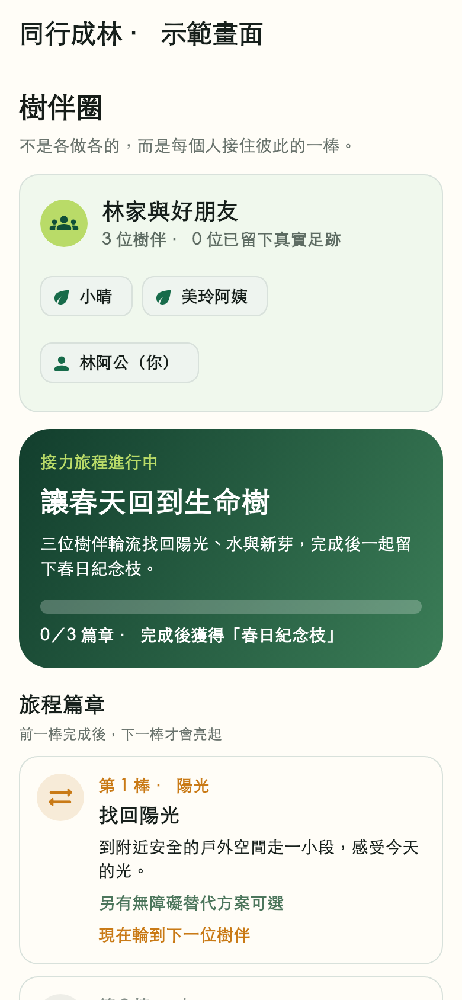
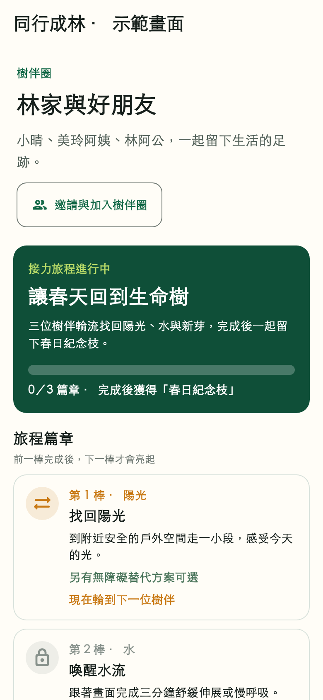
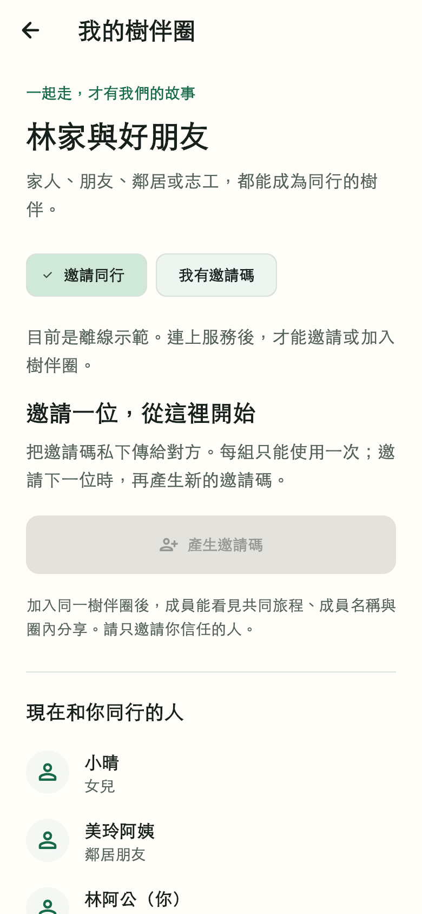
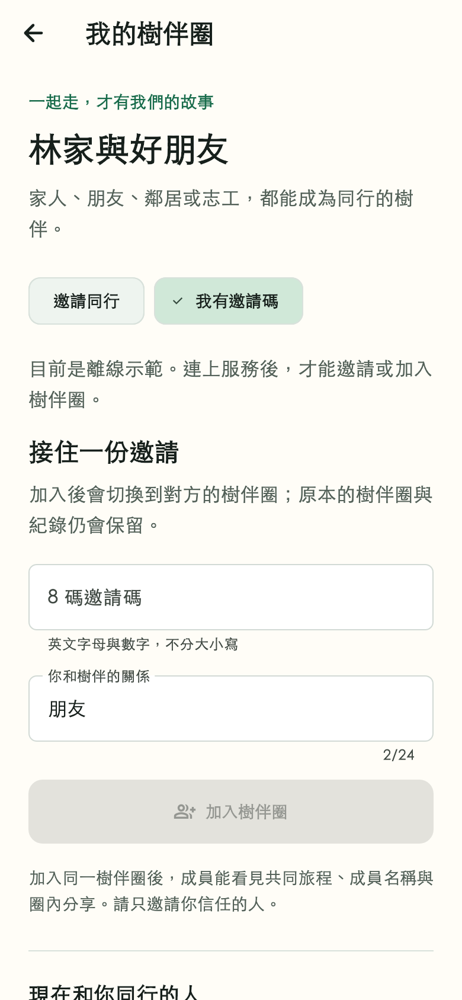

# App 優先：入圈到三人接力驗收

日期：2026-08-29。主要負責人：`@z1nnz`。工作分支：`codex/app-ready-circle-flow`。

後續更新：本頁保存 `54a56b4` 階段紀錄。圈名、類型、另外建立與設定管理權已在[首次使用與樹伴圈設定](app-circle-setup-evidence.md)接續完成；新測試的成員關係為六筆，新安裝包與檢查結果見該文件，不覆寫本頁的歷史數值。

本輪依使用者指示優先完成 App，韌體不擴充、不合併。以 App 分支 `codex/venue-witness-redemption` 的 `5fdf9e1` 為基底，在獨立工作區開發；原工作區的硬體修改、技能與其他檔案保留。此紀錄是本輪實作、設計與驗收證據，不代表整套產品已可正式上線，也不推定主要負責人已親自操作實體手機。

## 找到的問題與交付

- 原本只有「家庭」頁能邀請或加入；樹伴圈即使沒有旅程，也沒有成員入口。現在兩個頁面都通往獨立「我的樹伴圈」頁，朋友、鄰居與志工不必假扮家庭。
- 原加入表單在 API 失敗後也會關閉。現在驗證邀請碼格式、保留失敗輸入、區分失效／不存在／已加入，成功後才返回。
- 邀請碼顯示伺服器實際期限，完整複製、不把碼寫進全域通知；過期後不能再複製。每組一次性使用，新邀請不宣稱撤銷舊碼。
- 加入與切換共用忙碌保護。原樹伴圈保留，確認切換後清除舊圈內容；舊的核心／次要資料刷新與接力回應不能覆蓋新圈。
- 離線示範不發送加入或邀請請求。加入已成功、但後續內容暫時讀不到時，不誤報為加入失敗。
- 沿用既有服務契約與資料表；沒有為畫面改名而改資料欄位，沒有加入正式環境的驗證繞過。

## 設計與實際渲染

使用「介面匠心」「視覺雕琢」「隨屏舒展」：延續林綠、紙白與中文共同語言，將成員大卡縮為名字與生活足跡，讓邀請入口、當季旅程和篇章有清楚層級。新入圈頁使用單欄留白、可換行選項與一個主要按鈕；沒有新增字型套件、宣傳數字或裝飾動畫。

以下是同一套 Flutter 渲染測試、390 × 844 邏輯像素、文字比例 1.0 的前後畫面，輸出倍率 2。對照版從 `5fdf9e1` 的獨立工作區渲染。為避免測試預設方框字型，測試載入本機黑體及 Material 圖示；不散布系統字型，這也不是 Android／iOS 原生字體或實機截圖。資料明示為示範，不能當成真實使用者足跡。

| 修改前 | 修改後 |
| --- | --- |
|  |  |

| 邀請與成員 | 加入表單 |
| --- | --- |
|  |  |

## 真實 HTTP 與資料庫驗收

`circle-mobile.integration.test.ts` 啟動僅綁定 `127.0.0.1` 的真實服務，使用本次三個測試身分與專用資料庫；僅替換身分驗證，所有控制器、資料驗證、交易與 Flutter 資料解析皆實際執行。

手機測試執行以下流程並通過：

1. 三個獨立帳號建立初始樹伴圈。
2. 第一位產生兩組邀請，另外兩人透過 App 控制器加入；每人保留原圈。
3. 第二人切回原圈，再切回共用樹伴圈。
4. 三人各認領、完成一個篇章，每棒後從服務重新讀取進度。
5. 確認三位貢獻者、三個篇章、一次群體成長；重送最後篇章不增加第二次獎勵。
6. 以資料庫查核三人的成員關係共五筆，之後只清除本輪測試身分與其圈。

本機資料庫：`circle_acceptance_20260829`，PostgreSQL 16、以 Prisma schema 建立。此環境沒有 PostGIS，這次不測距離運算或宣稱遷移驗收。CI 延用既有 PostGIS 專用服務，新增本流程步驟，遠端結果以合併請求為準。

重現（先完成專用本機資料庫建置與 Flutter 依賴）：

```sh
npm run build:contracts
npm run build --workspace @elder-tree/api
CIRCLE_ACCEPTANCE_DATABASE_URL=postgresql://venue_test@127.0.0.1:55441/circle_acceptance_20260829 \
FLUTTER_BIN=/path/to/flutter \
npm exec --workspace @elder-tree/api -- vitest run src/store/circle-mobile.integration.test.ts
```

測試程式會拒絕遠端主機、非專用 acceptance 資料庫與正式環境。不要將上述資料庫換成個人、專題共用或正式資料庫。

## 本輪檢查

- 手機靜態檢查：通過、零問題。
- 完整手機回歸：59 項通過；普通執行跳過 3 項環境限定測試（畫面擷取、三人入圈 HTTP、據點 HTTP）。本輪另行實際執行畫面擷取與三人入圈 HTTP；據點 HTTP 留待本次 CI 回歸，不重用歷史結果充當本輪通過。
- 入圈相關單元／元件測試：24 項通過，含連點、晚到刷新／接力回應、離線禁止寫入、格式錯誤、失效提示、保留輸入及重試、複製、有效期限、退出後回應。
- 版面：360／390／768 寬 × 1.0／1.5／2.0 字級共九組通過；另測 360 寬兩倍字邀請碼，以及 768 × 390 橫向、長名稱、150 邏輯像素鍵盤遮擋。
- 真實三客戶端 HTTP／資料庫流程：1 項通過，內含上述完整旅程斷言。
- API 型別檢查、API 與共用契約建置通過；契約測試 3 項、API 一般測試 28 項通過。未提供資料庫環境的一般測試另跳過 33 項，不列為通過。
- Android：`flutter build apk --debug --no-pub` 建置成功，產物為 `apps/mobile/build/app/outputs/flutter-apk/app-debug.apk`，不提交可重建二進位。這是開發包，仍使用預設本機 API 位址；真機需另設可到達的 `API_URL` 與登入環境，不當成已連接正式服務的試用版。建置出現既有 Android SDK XML 與 Java 8 過時警告，但無建置錯誤。
  - 本機開發包約 215 MB，SHA-256：`30d1037fb0139fb714b34f8d1f1740813e7d61d0c7804a48066416460b12e7a4`。這不是正式上架包大小，也不保證另一台機器重建的二進位雜湊相同。
- iOS／macOS 與遠端 CI 狀態以本次合併請求為準，不用 Android 建置代替 Apple 或真機驗收。

畫面重現：從 `apps/mobile` 執行 `flutter test --no-pub test/circle_visual_capture_test.dart`，傳入 `--dart-define=CIRCLE_CAPTURE_DIR=/absolute/output`、`--dart-define=CIRCLE_CAPTURE_FONT=/absolute/local-font.ttc` 與 `--dart-define=CIRCLE_CAPTURE_LABEL=after`；普通測試不會寫出截圖。

## 尚未完成與下一段 App 工作

- 真實 Firebase 註冊／登入、不同實體手機、相機／定位、螢幕閱讀器及真人試用尚未驗收。HTTP 測試身分不等於正式登入。
- 建立圈目前仍沿用新帳號自動建立；自訂圈名／類型、另外建立一圈、離圈、管理權限與邀請撤銷還不是完整產品功能。
- 本輪完整跑的是三人接力；不是所有蒐集、探索、離線恢復、獎勵與長期旅程都已完成。
- 本輪隔離的是刷新與接力回應；其他既有非旅程操作的跨圈請求範圍仍需全面驗收。
- 先完成新使用者入圈引導與圈設定、接力完成後回到生命樹的動線、核心頁一致性與可安裝展示版本；硬體、合作諮詢等整體目標保留，韌體依使用者指示延後。
- 本分支以尚未合併的 #42 為基底；不因本輪通過，就宣稱 `main` 已包含所有 App 新版或整套系統已完成。
