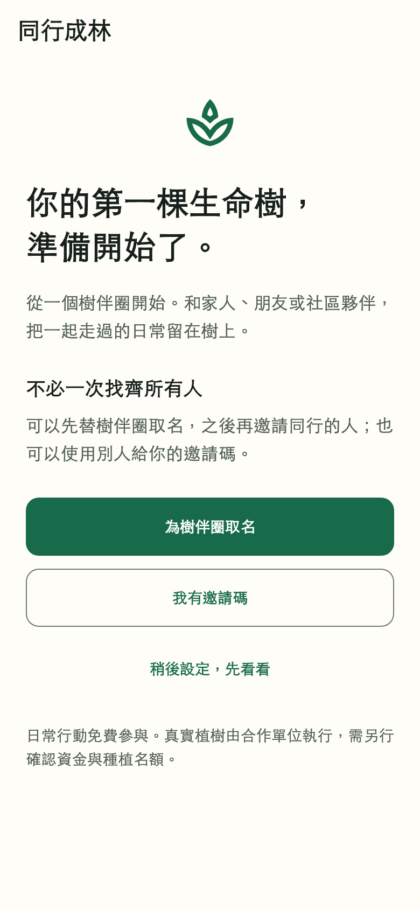
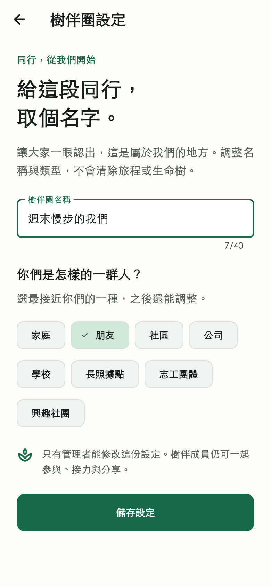

# App 優先：首次使用與樹伴圈設定

日期：2026-08-29。主要負責人：`@z1nnz`。工作分支：`codex/app-ready-circle-flow`。延續 [入圈與三人接力](app-circle-membership-evidence.md)，本輪只擴充 App 及必要後端，沒有修改或合併韌體。

## 可以實際操作的內容

- 新帳號先有一個「我的樹伴圈」，可以取名、選擇類型、輸入別人提供的邀請碼，或稍後設定先看看。
- 設定原本的初始樹伴圈不會另外建立第二圈。稍後設定以圈為單位存在本機；另一個尚未設定的圈仍可提示。
- 「我的樹伴圈」可以建立另一個圈，舊圈和生命樹保留；新圈有獨立生命樹、成員關係與旅程。
- 建立者能修改圈名和類型，受邀者可以參與但不能改設定。可選家庭、朋友、社區、公司、學校、長照據點、志工團體、興趣社團。
- 建立重送使用同一要求識別碼，伺服器只建一次；同碼不同內容拒絕，不默默新增另一圈。成功後其他內容載入失敗，不把已完成的建立當作失敗。
- 設定更新比對版本；過時表單不能覆蓋新內容，可明確重新載入再儲存。相同內容的回應遺失重送不會重複增加版本。
- 離線示範不建立或修改圈；錯誤保留輸入、送出時不能重複送出或返回。管理權限由後端決定，不信任手機傳入的管理者欄位。

## 資料與權限決策

既有 `Household` 繼續作為樹伴圈儲存，不為中文命名重做全資料模型。本輪新增 `settingsRevision`、`configuredAt`、成員的 `canManageCircle`，以及建立回執 `CircleCreation`。

遷移 `20260829060000_circle_setup` 保留既有名稱，將既有圈標為已設定，不突然強迫老使用者重新取名。既有資料沒有建立者紀錄：僅單人成員圈授予設定管理權，多人圈不猜測管理者。多人舊圈可繼續參與，管理權的補登程序尚未開放；不可用第一筆成員或姓名推定圈主。

新圈建立與回執、成員、生命樹、目前使用圈在同一交易提交；同一帳號的建立要求使用交易鎖序列化。設定更新使用明確圈識別碼、管理者條件和版本比對。資料庫與 HTTP 均有越權測試。

新手機應配合本輪後端及遷移部署。舊版手機可忽略新增契約欄位；新版手機讀取舊契約時預設沒有管理權、不強制引導，但舊伺服器不會因此支援建立／修改 API。

## 設計與實際畫面

使用「介面匠心」與「隨屏舒展」，沿用既有林綠、紙白及中文字體規則。新手頁的唯一主要動作是「為樹伴圈取名」；設定頁以一句共同旅程的標題、名稱欄位、可換行類型選擇與儲存按鈕組成，不堆疊統計卡、宣傳數字或裝飾動畫。

以下是 Flutter 實際渲染，390 × 844 邏輯像素、文字比例 1.0、輸出倍率 2。載入本機黑體及 Material 圖示，沒有散布系統字型。這是測試資料畫面，不是真人帳號或 Android／iOS 實機截圖；手機原生字體、鍵盤與螢幕閱讀器仍須真機驗收。

| 首次使用 | 樹伴圈設定 |
| --- | --- |
|  |  |

新頁沒有舊版一對一畫面；上一輪原有樹伴圈頁的前後對照仍留在原證據文件，不冒充本輪重做。

畫面重現，在 `apps/mobile` 執行：

```sh
flutter test --no-pub test/circle_visual_capture_test.dart \
  --dart-define=CIRCLE_CAPTURE_DIR=/absolute/output \
  --dart-define=CIRCLE_CAPTURE_FONT=/absolute/local-font.ttc \
  --dart-define=CIRCLE_CAPTURE_LABEL=setup
```

## 實際驗收

- 手機靜態檢查：零問題；完整回歸 **87 通過、3 個環境限定測試跳過**。畫面擷取與三客戶端 HTTP 另外實際執行，不把一般執行的跳過項算成通過。
- 新增 **28 項手機測試**：舊契約預設權限、按圈保存稍後設定、離線不寫入、舊刷新隔離、建立失敗重試、更新版本衝突、移除成員後權限不沿用、送出防重、新手設定原圈。
- 新手頁及設定頁各測 360／390／768 寬 × 1.0／1.5／2.0 字級，共 **18 組**；另測 768 × 390 橫向、大字與 150 邏輯像素鍵盤遮擋。主要按鈕可捲到並點選，沒有以縮字或限制系統字級通過測試。
- **4 項 PostgreSQL 測試**通過：實際遷移在獨立臨時 schema 執行後回滾；初始圈管理權；並行建立不重複及重試不重設改名；受邀者／外人不可改名與舊版本衝突。
- **2 項 HTTP 驗收**通過：真實 Nest 服務與三個 Flutter 客戶端完成初始取名、另外建圈、重試、改名、兩人加入、越權拒絕、原圈切換、三人接力與一次獎勵。資料庫確認三帳號共有六筆成員關係。另一項逐一拒絕空白名稱、未知類型、管理權欄位注入、控制字元、過長名稱、負版本。
- API 型別檢查與建置、Prisma schema 驗證通過；共用契約測試 3 項通過。API 一般測試 28 通過、38 個環境限定案例跳過；上述資料庫與 HTTP 案例另行指定環境執行。
- Android：`flutter build apk --debug --no-pub` 成功（本機增量建置約 20 秒）。開發包位於 `apps/mobile/build/app/outputs/flutter-apk/app-debug.apk`，約 247 MiB，SHA-256 為 `5df4491609fd48a506ab8bf230621ee683912016c5729b83413b4e58bba4414b`。未提交二進位；這是開發包，不是上架包大小或正式發布。預設 API 仍是本機位址，真機需設定可到達的 `API_URL` 與登入環境，不能直接當成已連線的試辦包。

HTTP 驗收只替換身分來源為本輪三個測試帳號，控制器、輸入驗證、資料庫交易、客戶端序列化都是真實程式。它不是正式 Firebase 註冊或多支實體手機測試。

本機專用資料庫為 `circle_acceptance_20260829`（PostgreSQL 16）。本輪已對它套用新增 SQL；沒有對原專題或正式資料庫操作。此環境沒有 PostGIS：新增設定遷移已測，不代表所有歷史遷移、距離查詢與現場定位均已驗收。CI 原本的 PostGIS 服務會執行完整遷移及回歸。

重現專用本機驗收（不要指向正式／共用資料庫）：

```sh
npm run build:contracts
npm run prisma:generate --workspace @elder-tree/api
npm run build --workspace @elder-tree/api
DATABASE_URL=postgresql://venue_test@127.0.0.1:55441/circle_acceptance_20260829 \
CIRCLE_ACCEPTANCE_DATABASE_URL=postgresql://venue_test@127.0.0.1:55441/circle_acceptance_20260829 \
FLUTTER_BIN=/path/to/flutter \
npm exec --workspace @elder-tree/api -- vitest run \
  src/store/circle-settings.integration.test.ts \
  src/store/circle-mobile.integration.test.ts
```

測試只清除本輪隨機帳號與對應樹伴圈；不是刪除既有使用者資料。

## 發布狀態與尚未完成

- 本輪在 [合併請求 #44](https://github.com/z1nnz/elder-tree-esg/pull/44) 延續開發，基底仍是尚未合併的 #42。上一提交 `54a56b4` 的十個遠端檢查已確認全部成功；不能把上一提交的結果算成本輪新增內容通過。
- 本輪新增內容的遠端檢查與合併狀態以 #44 最新提交為準；不宣稱 `main` 已含新版。
- 離圈、移除成員、移交管理權、多人舊圈補登管理權、撤銷邀請尚未完成；建立識別碼只在目前表單存活期間重用，沒有跨 App 重啟的離線送件佇列。
- 正式 Firebase 登入、實體手機的相機／定位／通知／螢幕閱讀器、真人新手試用與接力完成後回到生命樹的完整動線仍需驗收。
- App 優先順序不變：接下來完成生命樹成果與後續旅程、核心頁一致性和可重現展示驗收；硬體及合作工作保留，韌體暫停。

這份紀錄保存主責專題的需求決策、程式差異、畫面、測試與限制，不代填主要負責人的真機操作、合作訪談或尚不存在的研究結果。
