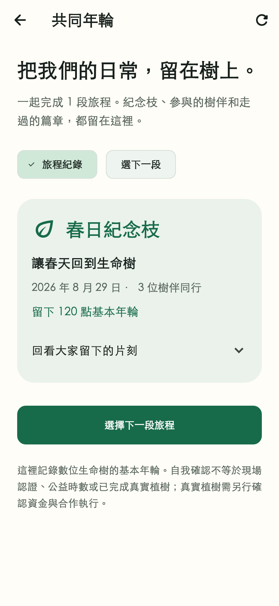
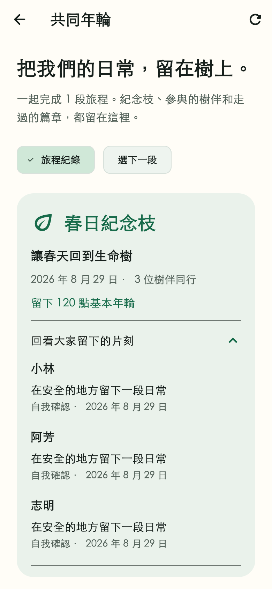
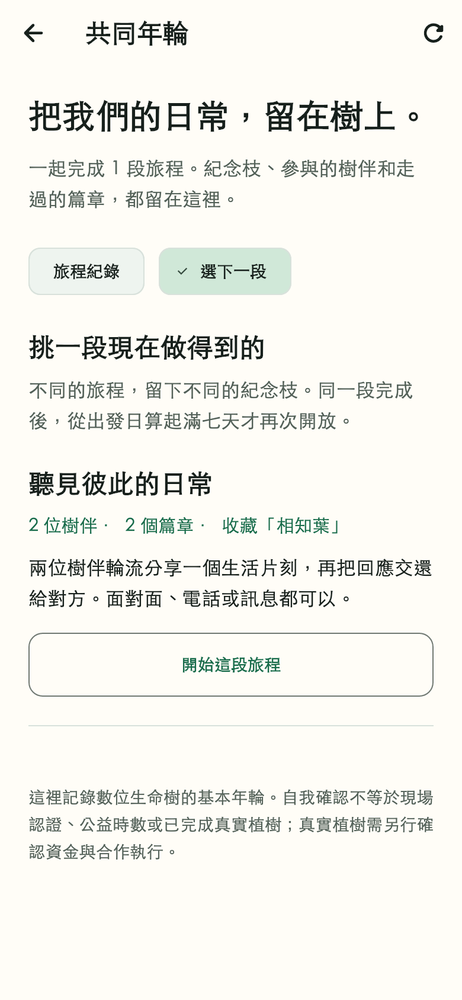

# App 優先：共同年輪與下一段旅程

日期：2026-08-29。主要負責人：`@z1nnz`。分支：`codex/app-ready-circle-flow`。延續[首次使用與圈設定](app-circle-setup-evidence.md)，本輪只修改 App 與必要後端，原專題的韌體工作保留、不合併。

## 交付與玩法取捨

之前每圈只會拿到同一段接力，完成後沒有下一段，也沒有獨立保存的成果冊。本輪把流程接成：

**選擇旅程 → 樹伴輪流接棒 → 共同年輪保存成果 → 選下一段；舊成果不重設。**

- 接完最後一棒，可直接打開「共同年輪」；生命樹頁也有獨立入口。
- 成果保存紀念枝、當次旅程名稱、參與者、採用的行動、替代方案、見證層級、時間及實際入帳的基本年輪。後來改名，不回寫既有成果。
- 追加兩段免費接力：「聽見彼此的日常」由兩位樹伴分享與回應，留下「相知葉」及 80 點基本年輪；「把好意傳下去」由三人問候、照顧共同角落與感謝，留下「暖心枝」及 100 點。原春日旅程保留。
- 都提供文字／遠距等替代行動，不要求消費。這三段目前使用自我確認，不宣稱已驗證實際散步、對話內容或公益時數。
- 每圈只有一段目前旅程。完全沒人接棒或貢獻時可以換；一旦開始接力，先共同完成。旅程下架、到期或改期時可離開，不把人卡在不能完成的篇章。
- 同一旅程再次開放，需從上一趟有參與或已完成的旅程「出發時間」算起滿七個二十四小時。不是每週一重設，也不是完成後再等七天；未開始就換掉的旅程不占冷卻時間。
- 可重新走同一旅程，但每次有新紀錄與新回執。這是第一版節奏規則，不是長期留存效果的證明。

## 資料、重送與並行一致性

`20260829070000_journey_continuation` 保留所有既有旅程與貢獻，新增目前旅程標記、前段旅程識別碼與成果快照。舊資料優先選已有認領或貢獻的進行中旅程，其次其他進行中旅程，再選較新的紀錄；不刪除或偽造完成其他旅程。

資料庫部分唯一索引限制每圈只有一筆目前旅程；前段識別碼唯一約束防止同一段分岔。切換使用圈鎖及旅程鎖，和既有接棒鎖共用順序，驗證「有人接棒，同時另一人換旅程」只會有一方成功。相同前段與相同目標的重送回到既有旅程，不重建；不同分支或過期前段拒絕。

最後一棒的貢獻、一次性成長入帳、成果快照與完成狀態在同一交易保存。快照採實際成長回執，不直接把範本點數當成已入帳。較早完成且沒有快照的資料，在讀取時依現存資料整理、標註「較早的旅程」，不聲稱姓名是在當年保存。

成果以目前圈隔離、每頁十二筆；外圈游標拒絕。手機切圈會清空舊紀錄，晚到的回應不能把前一圈的私人內容放回畫面。若完成已成功而生命樹重新讀取失敗，明示「已完成、資料稍後刷新」，不引導重複提交。

部署必須執行 SQL 遷移；只做 `prisma db push` 不會建立上述部分唯一索引。新版 App、後端及遷移需配套，舊伺服器沒有成果冊端點。本輪只在專用本機資料庫操作，沒有修改正式資料。

## 介面工藝與畫面

依「介面匠心」和「隨屏舒展」沿用林綠、紙白與中文字體規則。共同紀念枝是成果頁主角，參與細節收在可展開的故事紀錄；「旅程紀錄」與「選下一段」分開，不把資料統計塞滿首頁。文字與選項可換行，不限制系統放大字級。

以下為實際 Flutter 渲染：390 × 844 邏輯像素、字級比例 1.0、輸出倍率 2，使用本機黑體與圖示，未散布系統字型。姓名及成果是隔離測試資料，並非真人活動或實體手機截圖。新頁沒有一對一舊畫面；之前入圈頁的前後對照繼續保留。

| 共同年輪 | 展開參與紀錄 | 下一段旅程 |
| --- | --- | --- |
|  |  |  |

重現擷取，在 `apps/mobile` 執行：

```sh
flutter test --no-pub test/circle_visual_capture_test.dart \
  --dart-define=CIRCLE_CAPTURE_DIR=/absolute/output \
  --dart-define=CIRCLE_CAPTURE_FONT=/absolute/local-font.ttc \
  --dart-define=CIRCLE_CAPTURE_LABEL=journey
```

## 實際驗收

- 手機靜態檢查零問題，完整手機回歸 **118 通過、3 個環境限定測試跳過**；沒有把跳過計為通過。
- 新增 **31 項手機測試**：離線不寫入、晚到回應隔離、分頁去重、失敗保留紀錄、送出防重、完成後樹資料讀取失敗、成果／過期旅程入口、空紀錄與不可開始原因。紀錄／選旅程兩種畫面各驗收 360／390／768 寬 × 1.0／1.5／2.0 字級，共十八組，主要操作可捲到並點選。
- **12 項新增 PostgreSQL 測試**：成果快照、實際回執、改名不改歷史、並行選擇、重送防分岔、七日後再走、外圈隔離、未開始可換、分頁與歷史匯入、接棒／換旅程競態、二人圈選二人旅程、下架／到期／改期回復，以及實際 SQL 遷移保留貢獻／唯一索引拒絕重複目前旅程。
- **4 項既有圈設定資料庫測試、2 項真實 HTTP 驗收**重新執行。三個 Flutter 客戶端連 Nest／PostgreSQL，完成入圈、三人春日接力、讀成果、選二人旅程、兩人再完成及第三人重讀兩份成果。驗收標記為 `JOURNEY_CONTINUATION_PASSED:2-journeys-2-receipts`。HTTP 另拒絕無效識別碼、非法游標及客戶端注入成長點數／目前旅程欄位。
- 另執行既有持久化接力／替代行動兩項，均通過；該選測中的其他二十四項是未選取，不列為通過。
- API 型別檢查及建置通過；API 一般測試 **28 通過、50 個環境限定案例跳過**。上述資料庫與 HTTP 案例另行指定環境執行，共用契約三項通過。
- 三張畫面實際擷取並檢視。Android 開發 APK 建置成功，259,344,219 bytes，SHA-256：`71032e8244013d32729a785f882c362b2439a7480f7cd6567c4324a7300f5b95`。檔案為 `apps/mobile/build/app/outputs/flutter-apk/app-debug.apk`，未提交二進位。預設本機 API／登入環境仍需為真機設定，不是已上架或可直接連線的正式試辦包。

驗收中新增到期案例的測試資料曾缺少必填成長欄位、並誤共用唯一的篇章任務；改成完整隔離資料後重新通過，未移除限制或放寬正式規則。產品邏輯檢查則補上「改期到未來」也可離開原旅程，避免畫面顯示結束但伺服器仍禁止換段。

專用環境為 PostgreSQL 16 的 `circle_acceptance_20260829`，沒有 PostGIS。新增 SQL 在隔離 schema 實際測試、故意觸發唯一約束後回滾；不以此宣稱全部歷史遷移或現場距離驗收。CI 仍使用 PostGIS。

重現端到端驗收前先產生 Prisma client、編譯契約及 API；不要把測試連到正式或共用資料庫：

```sh
npm run prisma:generate --workspace @elder-tree/api
npm run build:contracts
npm run build --workspace @elder-tree/api
DATABASE_URL=postgresql://venue_test@127.0.0.1:55441/circle_acceptance_20260829 \
CIRCLE_ACCEPTANCE_DATABASE_URL=postgresql://venue_test@127.0.0.1:55441/circle_acceptance_20260829 \
FLUTTER_BIN=/path/to/flutter \
npm exec --workspace @elder-tree/api -- vitest run --no-file-parallelism \
  src/store/journey-library.integration.test.ts \
  src/store/circle-settings.integration.test.ts \
  src/store/circle-mobile.integration.test.ts
```

測試只清除本輪隨機帳號、圈及隔離範本，不刪除原專題資料。HTTP 僅替換身分來源，並非正式 Firebase 或三支實體手機驗收。

## 審查、發布與未完成項目

- 技術自查範圍：自 `31c0b8d` 之後的 App／契約／API 差異。已檢查資料遷移、圈隔離、唯一約束、接棒競態、重送、失敗回復與舊資料保留；沒有夾帶韌體、私鑰、真人資料或建置產物。
- 需求自查：接力能延續、共同成果可回看、二人圈可選適合旅程、免費核心與真實植樹分離。這不是完整的季節編排、拼圖、城市探索或長期留存驗證。
- 延續 [合併請求 #44](https://github.com/z1nnz/elder-tree-esg/pull/44)，仍以尚未完成實機驗收的 #42 為基底。上一提交 `31c0b8d` 十個遠端檢查全成功，不代表本輪新提交已完成遠端驗收；最新狀態以合併請求為準。
- 本輪查核 `main` 仍為 `fa6bddedac1126a10fa587d3779bd95f92eb9b5b`，不含此新版；朋友直接複製預設分支不會取得本輪功能。
- 圈內成員目前仍需重新整理取得別人的新進度，不宣稱即時同步。個人資料刪除／保存政策、離圈與管理權移交尚未完整交付。
- 全 App 的首頁、探索、陪伴、長圈名與大字一致性仍需下一輪修整；本輪十八組版面測試只涵蓋新增成果冊，不代表每個頁面都已驗收。
- 正式 Firebase、相機／定位／通知、螢幕閱讀器、真人試用、完整季節內容及資金支持的真實植樹仍待驗收。未代填主要負責人的真機、訪談或研究成效。

接下來繼續 App 核心頁一致性及可重現展示，韌體不插入這一階段。
