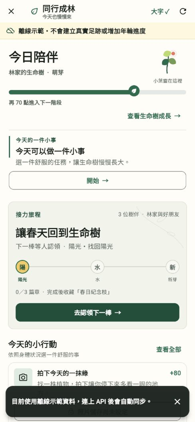

# 議題 #37：手機首頁視覺基礎驗證

- 主要負責人：[@z1nnz](https://github.com/z1nnz)
- 驗證日期：2026-08-22
- 驗證尺寸：390 × 844
- 驗證範圍：首頁首屏、離線狀態、今日陪伴、生命樹進度、接力旅程與單一主要動作

## 設計判斷

本版移除多層圓角卡片、頭像泡泡與大面積深色宣傳卡，改採自然手帳式的留白、植物線稿與接力節點。首屏只有接力旅程使用實心主要按鈕；今日小事降為框線次要動作，讓使用者先理解現在輪到誰，再決定是否接棒。

## 驗證結果

- `flutter analyze`：通過，零問題。
- `flutter test`：20 項測試全數通過。
- 小尺寸測試：首頁測試固定於 390 × 844，未發生溢位。
- 無障礙：保留作業系統文字縮放，長者模式只提高最低倍率；動態效果遵守減少動態設定。
- 邊界：本圖使用本機離線示範資料，只驗證介面與操作層級，不代表正式伺服器或真實行動見證已上線。
