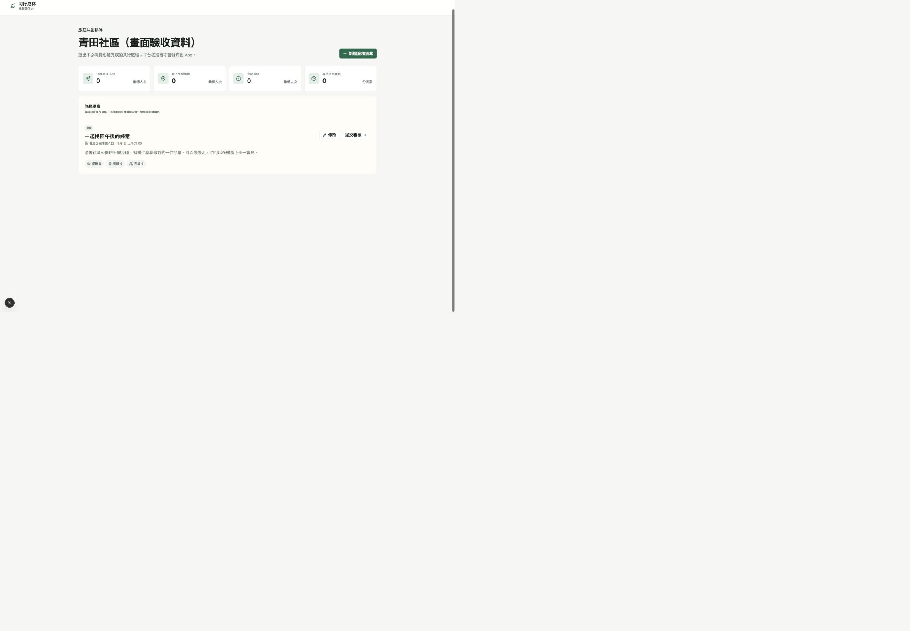
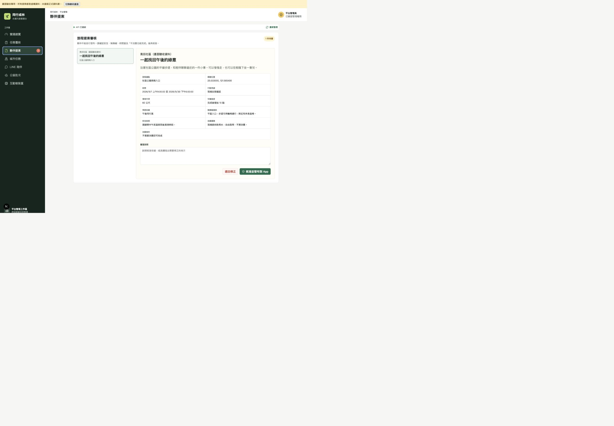

# 議題 #39：共創夥伴台與審核發布

- 專案主要負責人：[@z1nnz](https://github.com/z1nnz)
- 驗證日期：2026-08-27
- 需求：[議題 #39](https://github.com/z1nnz/elder-tree-esg/issues/39)
- 決策：[提案與發布權限分離](../adr/0002-separate-partner-proposals-from-platform-publishing.md)

## 本次交付

夥伴只能操作自己的組織提案；平台審核後才建立已發布的城市旅程。提案包含據點、時間、行動見證、安全、無障礙與自願回饋。手機端同步顯示這些資訊，所有合作旅程不消費也能完成。

介面採取低裝飾、清楚文字層級的工作區設計。移除發光雷達、漸層卡片、示範姓名、無作用的搜尋／通知按鈕、固定趨勢圖與固定公益進度；主要動作集中在提案或審核，讓使用者知道下一步。

## 畫面證據

以下畫面使用暫時的本機驗收頁與虛構資料，載入正式介面元件。沒有登入真實合作夥伴帳號，也沒有寫入正式資料庫。驗收頁已於提交前移除，不會隨產品發布。

實際操作：修改提案、切換停留計時、儲存、重新打開，確認預設 180 秒保留。桌面與窄螢幕均檢查主要流程；窄螢幕瀏覽器回報的 CSS 寬度為 487，頁面寬度亦為 487，未觀察到水平溢位。不將瀏覽器要求的 390 冒稱為實際 CSS 尺寸。

## 本機驗證

- `npm run typecheck`：通過。
- `npm test`：23 項通過；26 項資料庫整合測試因本機未提供測試資料庫而跳過。
- `npm run build`：通過，後台輸出路由不含臨時驗收頁。
- `flutter analyze`：通過；`flutter test`：20 項通過。
- Prisma schema 驗證與用戶端生成：通過；不等同正式資料庫已遷移。

新增整合案例涵蓋跨組織拒絕、非夥伴拒絕、禁止強制消費、舊資料送審驗證、修改與送審並行、重複核准、手機欄位傳遞及同一帳號跨圈去重。資料庫遷移與整合案例交由 CI 臨時 PostGIS 執行，結果以合併請求的最新檢查為準。

## 審查與邊界

第一輪雙軸審查指出交易競態、舊提案繞過驗證、統計去重、欄位傳遞與表單狀態問題，均已修正並本機複核。修正後第二輪獨立複核因用量限制未執行，不記為通過。

這是可測試的技術切片，不代表已有正式合作、商家轉換率提升或真實植樹成果。短效動態碼、優惠核銷、正式環境遷移、合作帳號佈建與現場試辦仍需後續驗收。
