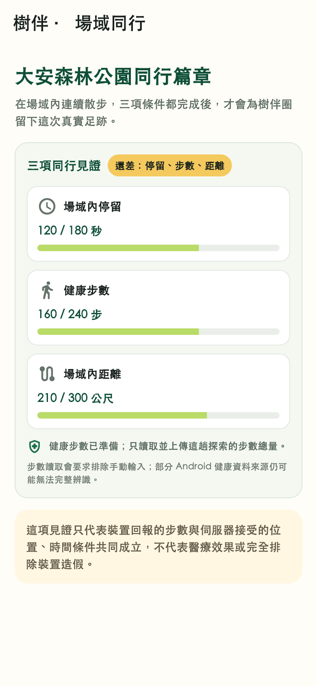

# 第三級場域行程見證證據

日期：2026-08-30

追蹤議題：[GitHub #47](https://github.com/z1nnz/elder-tree-esg/issues/47)

工作分支：`codex/journey-witness`

## 問題與主要負責人決策

既有城市探索只要抵達一次就能解鎖，不能支持「在一個場域完成一段同行」的主張。本次由主要負責人 `@z1nnz` 決定把第三級見證限定為地理圍欄篇章，且必須同時符合場域內停留、健康步數與場域內距離：

- 只計算連續位於指定範圍且定位誤差不超過 50 公尺的樣本；
- 樣本間隔超過 120 秒，空白時間、距離與步數都不承接；
- 步數只讀 Apple 健康或 Health Connect 的工作階段累計值，要求排除手動輸入；
- App 不讀取或上傳心率、睡眠、診斷、路線明細等其他健康資料；
- 三項條件全部達成後，才完成篇章並增加一次年輪；完成後開新工作階段也不再建立第二份見證；
- 拒絕健康步數權限不阻擋地圖探索，但清楚說明該篇章無法形成複合見證；
- 本層級不得用於優惠核銷、志工時數、企業永續成果、成樹準備或真實植樹。

詳細取捨見[架構決策 0004](../adr/0004-use-consecutive-in-area-samples-for-journey-witness.md)。

## 跨端實作

- 夥伴後台：地理圍欄篇章可設定最低停留秒數、步數及場域內距離；任一數值不合法或不是地理圍欄時不得發布。
- 資料庫：工作階段只在行程期間暫存步數總量／來源；定位回執只留粗略區域與該段距離；篇章見證保存三項累計與完成摘要，並以資料庫索引限制同一圈子、使用者與篇章只能形成一份完成見證。
- 隱私清理：定位事件回執不保存健康步數；常駐 API 每分鐘清理四小時前仍未結束工作階段的最新精確座標。
- API：同一交易內判斷定位、樣本間隔、合理步頻、場域內距離及三項完成；冪等事件與既有成長回執共同防止重複成長。
- App：只在所選路線含未完成的複合篇章時請求唯讀健康步數；Android 另請求活動辨識權限，iOS 啟用 HealthKit 能力。
- App 介面：停留、步數與距離分開顯示進度及尚缺條件，保留大字與寬螢幕排列。

## Flutter 實際渲染畫面

畫面由正式 Flutter 元件在 390 × 844 測試視窗渲染，像素輸出為 780 × 1688；SHA-256 為 `6d6f26ba4ee272ad2de1da6c91b1d55f4010572876d8b918a10f8ddff4fffe55`。這是新增元件，舊版沒有可對照的同功能畫面，因此沒有把不同功能頁冒充「修改前」。畫面資料是固定驗收資料，不等於真人已走完行程或實體手機試辦。

## 本機驗證

| 驗證 | 結果 |
| --- | --- |
| `npm run typecheck` | 所有 Node 工作區通過 |
| `npm test` | 契約 3 項、API 40 項、夥伴後台 12 項、物聯網橋接 2 項通過；52 項需資料庫及 1 項後台即時案例依設計跳過 |
| 行程見證純函式測試 | 6 項通過，涵蓋場外、斷線、異常步頻、三門檻與精確完成邊界 |
| Prisma 結構 | 使用非正式本機連線字串解析結構，驗證通過；未把它宣稱為資料遷移執行 |
| `flutter analyze` | 零問題 |
| Flutter 完整回歸 | 175 項通過、3 項隔離服務案例依設計跳過 |
| 行程步數控制器 | 3 項通過：按路線詢問權限、只送工作階段累計、拒絕不阻擋地圖 |
| 行程進度版面 | 360／390／768 寬 × 1／1.5／2 倍文字均無版面例外 |
| Android 除錯版 | 本機建置通過；225,850,572 bytes；SHA-256 `bcdfd829fbd31ea1bcf653fd0e3b972426c7fe5a4d2ec040546bfd5af3955ad8` |
| iOS 模擬器編譯 | Xcode 完整建置通過；只證明可編譯，不當成互動品質或實機驗收 |
| 平台宣告 | Android Manifest、iOS Info.plist 與 HealthKit entitlement 語法驗證通過 |

本機沒有另建正式資料庫或上傳健康資料。需要 PostGIS 的資料庫整合、乾淨環境 migration 及遠端跨平台工作由本次合併請求的 CI 重新驗證；結果通過前不列為完成。

## 尚未證明

- 尚未完成 Android／iPhone 實體手機的健康權限、背景切換、斷線與長時間行走驗收。
- 尚未完成橫向、軟體鍵盤、VoiceOver／TalkBack 實機操作；本頁沒有文字輸入，但仍不以元件語意測試取代真人輔助操作驗收。
- 健康平台的手動輸入排除能力因來源而異；Android 介面已直接說明限制。
- 裝置回報與位置條件成立不等於能證明行走者身分、姿勢、醫療效果或完全排除裝置造假。
- 畫面截圖與模擬器編譯不等於動畫品質、真人可用性或正式試辦成果；生命樹動畫與美術品質另列為下一個 App 優先開發目標。
