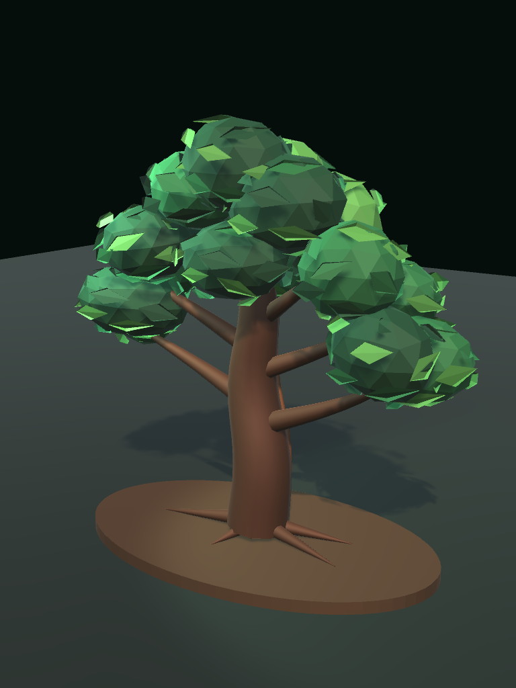
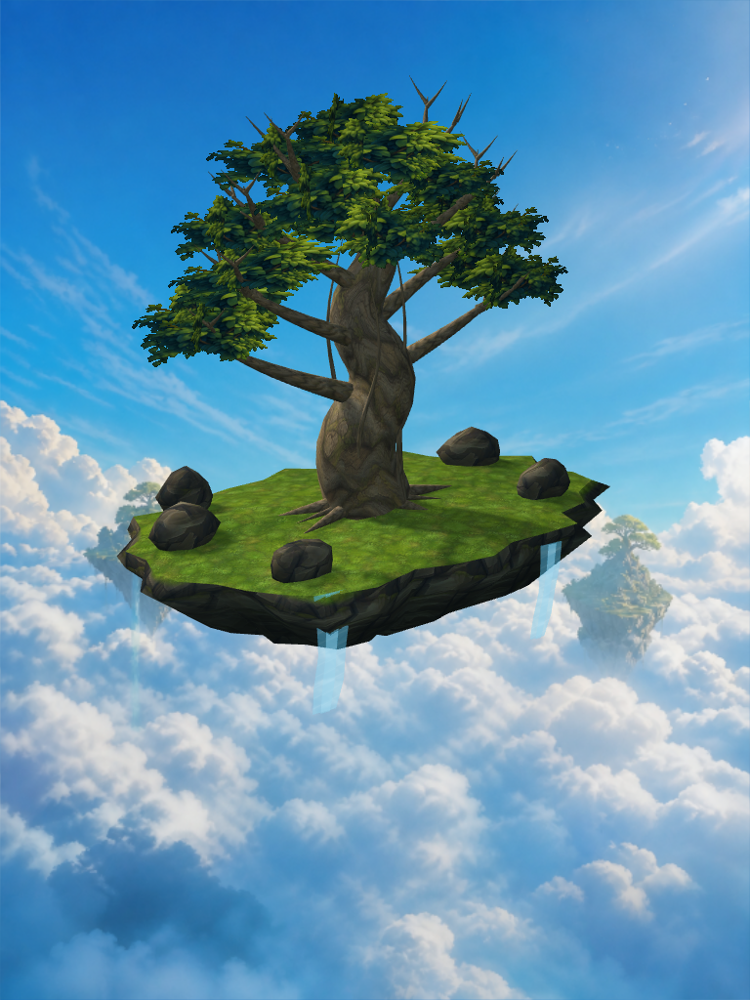
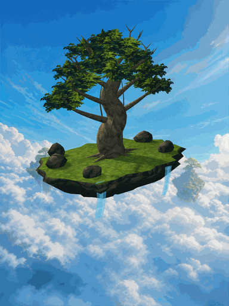
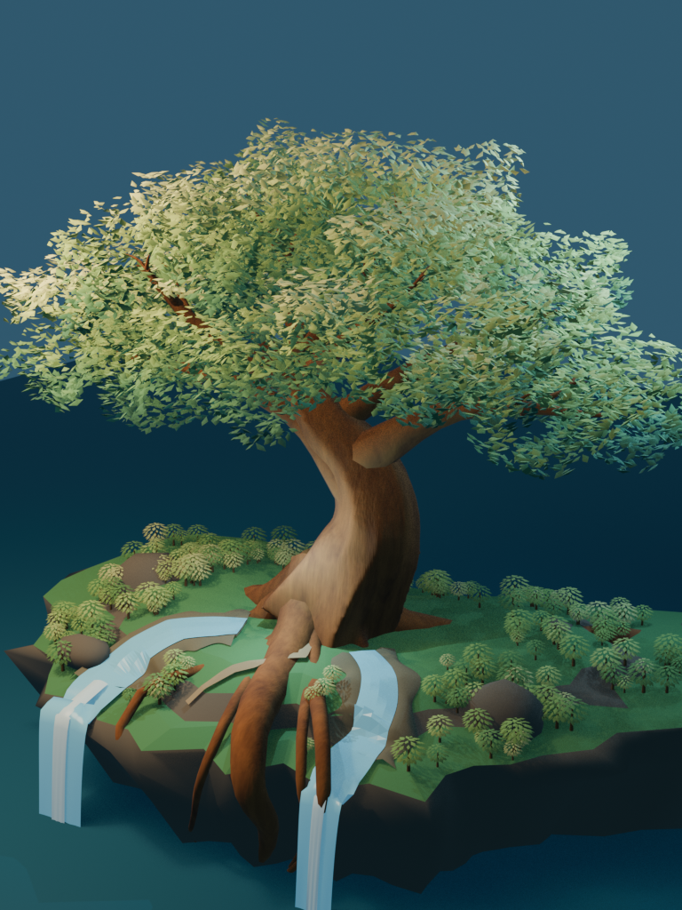
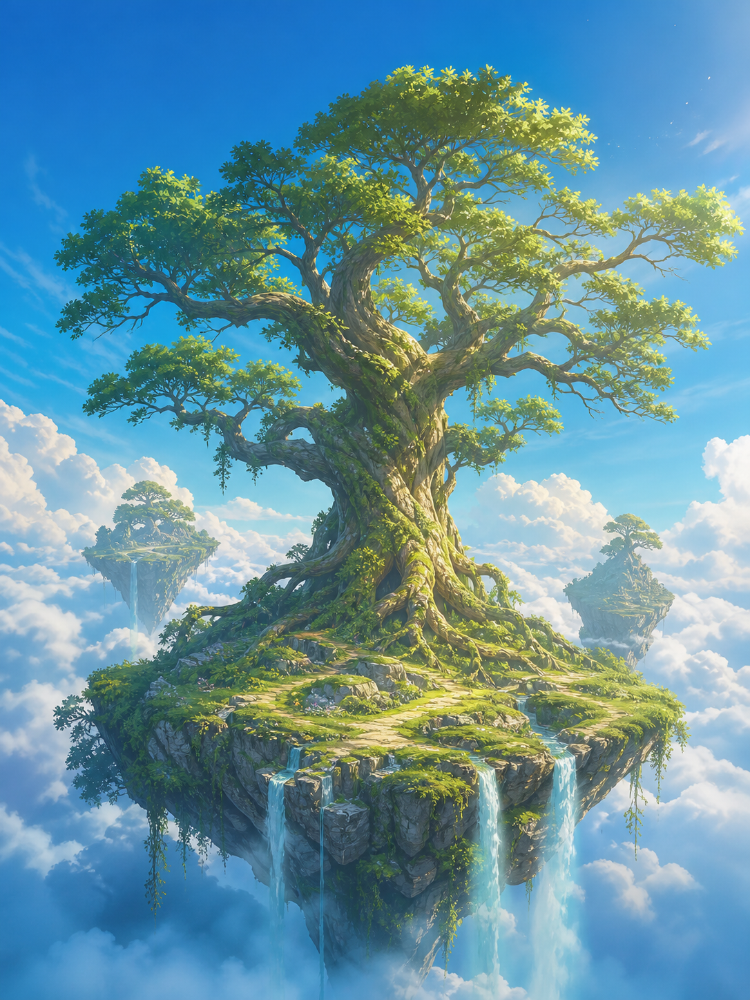
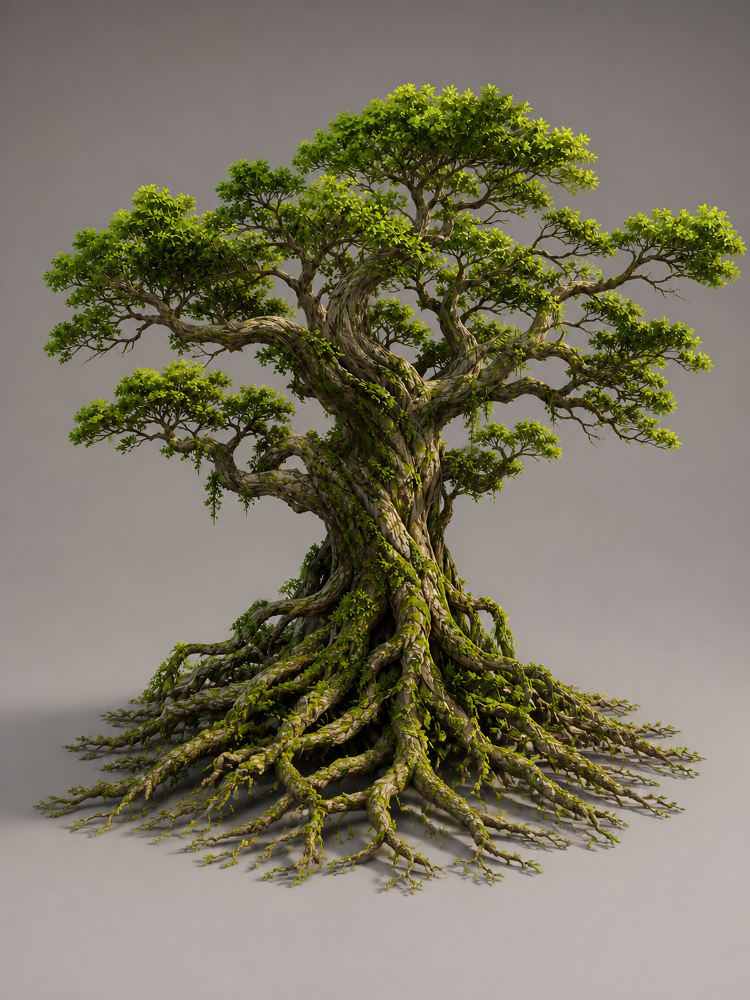

# 生命樹浮島世界重製基礎與正式美術門檻紀錄

## 目標與範圍

- 工作議題：[生命樹浮島世界：重製主角樹、環境層次與手機級動畫 #53](https://github.com/z1nnz/elder-tree-esg/issues/53)
- 實作分支：`codex/life-tree-floating-world`
- 主要負責範圍：構圖採用、資料掛點邊界、Blender 可重建資產、Unity 場景組裝、手機取景、測試判讀與正式版本驗收。
- 外部參考圖只作氣氛討論，沒有收進專案，也沒有描摹其島形、樹形、建築或地貌。正式資產由本專案的 Blender 產生腳本與母稿建立。

2026-09-02 第三輪人工檢視結論：主相機改到 Blender 正面後，兩道近景瀑布正式進入構圖；葉簇使用局部材質微風，主枝保留低頻小幅搖動，瀑布以程序流紋向下移動，主相機在三秒內只做不到一度的呼吸環繞。正常動態與降低動態共用後端狀態入口；降低動態會恢復主枝與相機原位，並把葉簇和瀑布的全域動態量歸零。程式審查曾發現流紋相位方向相反，本輪已修正並重新輸出預覽。這一輪已從靜態材質樣本進入可重現的手機級待機動畫樣本，但尚未通過正式美術驗收：主枝剪影仍偏對稱、地表石塊仍像臨時道具，也沒有完成水霧、粒子、後製和六階段成長。因此仍不得建立合併請求或宣稱大型商業遊戲最終品質。

## 可核驗資產

| 項目 | 結果 |
| --- | --- |
| 資產版本 | 2 |
| 匯出網格物件 | 97 |
| 頂點 | 10,119 |
| 三角面 | 16,786 |
| 獨立葉片元素 | 0 |
| 合併葉群網格 | 16 |
| 透明葉簇面片 | 48 |
| 主枝／可動葉冠／掛點 | 8／16／12 |
| 三維中央島／近景瀑布／三維雲塊 | 1／2／0 |
| FBX SHA-256 | `eaf0be194f0aed8ebdf4b00697eb0cc56065a12a20d7c52444572b7730aa710a` |
| GLB SHA-256 | `47b178ca872461e82a089f0642d2137d3ed9ee208e3124a53d29265c7f74056c` |

Blender 產生腳本會在匯出時檢查上述固定數量與 14,000～60,000 三角面預算；任一契約不符就中止。十六個可動葉冠各由三張交叉透明葉簇面片建立可讀體積，不再保存或匯出 1,152 片獨立葉子；網格物件為 97，遠方島嶼與雲海仍由二維背景板承擔。這些數字只是繪製成本的代理指標，不等同實機繪製呼叫次數、透明排序成本或幀率；正式數字仍須由 Unity 分析器與實機擷取證明。

## 同尺寸前後對照

重製前基線，768 × 1024 Unity 主相機畫面：



目前重製基礎，768 × 1024 Unity 主相機畫面：



- 重製前畫面 SHA-256：`690bb07459ee90db71e17864886d88096f33ac6f5dfb1e4dc1ab3bafe64cf08a`
- 目前畫面 SHA-256：`cf62c5209981b5c0d321d15a96a2c5f427e544200588547b46a1a2d0bf38e361`
- 比較結果：已改善取景、背景規模、主幹輪廓、三級枝梢、葉冠密度、樹皮與浮島材質；正面視角現在能看見兩道瀑布與主要盤根。未過門檻的主要原因已轉為主枝剪影、地表構圖、水霧／粒子、後製與六階段內容。

三秒 Unity 真實場景動態預覽（由 90 張 768 × 1024 影格擷取，再取樣為 45 幀、384 × 512 GIF；不是概念動畫）：



- 動態預覽 SHA-256：`c81cfcdc1f108d27c1259639c699d92e772038db6da9bc8cb1d54bdfa8d738b9`
- 這段預覽證明同一 Unity 場景的主枝、葉簇、瀑布與相機參數會隨時間改變；離線逐幀輸出不等同實機每秒 30 幀，也不證明溫度、記憶體或耗電達標。

## 產製檢查畫面

Blender 品質預覽（用於檢查造型、燈光與材質）：



上方目前畫面不是 Blender 預覽冒充 App 畫面。它由 Unity 主相機直接渲染，前景為可受資料控制的三維樹與中央島，遠方天空、雲海與兩座旅程島是本專案原創二維背景板。葉簇使用雙面透明裁切著色器，浮島使用草地／岩層三向投影著色器；混合場景取景邊界為 7.24 × 3.09 × 4.90，相機距離 20.00。

## 正式重製標準





兩張圖由內建圖像生成工具依樹伴需求產生，作為原創視覺方向與 Blender 拆解參考，不是 Unity 畫面，也不能直接證明可執行品質。正式重製採三維主樹與中央島、二維遠景群島與天空、Unity 即時雲霧／瀑布／枝葉動態的混合方式。

- 浮島世界設計稿 SHA-256：`2c20de348d408d746e01e387c419eba884644db81e834432517c7a94431b0823`
- 主樹建模參考 SHA-256：`cdf49056f05b3ea66a291639b5e94ad9a93cdfcde09a1820f6e123d6842c41c8`
- 遠景背景板 SHA-256：`355b5b997d92d9565a7d50427660a5edc032e3a8822bc91de799cfe9d61bad33`
- 原創生成式樹皮色彩貼圖 SHA-256：`c45fe3ad7ac94464de2ecb8f615ac14c5a92133824458d13b40be56ea5caf3ee`
- 原創風格化葉簇貼圖 SHA-256：`f1fa205a54e5bba64a2b7c01b798945b9355c852197fcb8e45982c4874a80416`
- 原創浮島草地貼圖 SHA-256：`f300dd0643153d5c1d2cc0d8da472cd5ae4b008384ae05178c68eae393251a66`
- 原創浮島岩層貼圖 SHA-256：`e2d3c7b13565a7ab8583ab594f76079e33e8c43210c41b6af88b2c60ae2eff86`
- Unity 共用樹皮／葉簇／浮島／島岩材質 SHA-256：`36769deac2eacabfd025e2514609e1acb7f9d16ec7db69e910492630d1ff1325`／`e8798b9bfc098ad085fbf32db16c53d2edf38303512439b7277fa38487c6bc03`／`4a8813e672e968efecb54c539f3054d7c2960fc88921302893bb7311f249baea`／`0450355565be51370dff8b668bf7f2a740d47276c764fd6b45804c69757a078d`
- Unity 瀑布流光材質 SHA-256：`7efd240e82e61f6558d6f189e0cb86dbb2db1f12c75277d43b77883db6670cb5`
- Unity 場景 SHA-256：`c88ae27f6cb15b48708f5f91989acecc81703697cb9abece0a752c8e61c2f08c`
- Blender 品質預覽 SHA-256：`090e13d20a73a7d14426f630533c7ae925d1b3b767e4ae30463146d50971f129`
- 兩張原圖均無使用者照片、人物、品牌標誌或第三方遊戲素材；提示詞與限制保存於同資料夾的來源紀錄。

## 重現與測試

```sh
blender --background --python tools/blender/build_life_tree.py -- \
  --output apps/life-tree-unity/Assets/Art/Generated \
  --source art-source/blender

/Applications/Unity/Hub/Editor/6000.0.82f1/Unity.app/Contents/MacOS/Unity \
  -batchmode -quit \
  -projectPath apps/life-tree-unity \
  -executeMethod TreeCompanion.Editor.LifeTreeSceneBuilder.BuildAndCapture

/Applications/Unity/Hub/Editor/6000.0.82f1/Unity.app/Contents/MacOS/Unity \
  -batchmode -quit \
  -projectPath apps/life-tree-unity \
  -executeMethod TreeCompanion.Editor.LifeTreeSceneBuilder.BuildAndCaptureMotionPreview

/Applications/Unity/Hub/Editor/6000.0.82f1/Unity.app/Contents/MacOS/Unity \
  -batchmode \
  -projectPath apps/life-tree-unity \
  -runTests -testPlatform EditMode \
  -testResults /tmp/tree-companion-final-tree-tests.xml \
  -logFile /tmp/tree-companion-final-tree-tests.log
```

- Blender 腳本 Python 編譯檢查通過。
- Blender 場景、母稿、FBX、GLB、統計與預覽重新產生成功。
- Unity 場景自動重建及主相機截圖成功。
- Unity 編輯器測試 11／11 通過（2026-09-02 重新執行，0 失敗、0 略過）；案例會核對正常動態可改變相機姿態、降低動態能恢復原位並歸零全域動畫量，以及瀑布使用受同一開關控制、垂直流向明確朝下的正式流動材質。測試報告位於本機暫存路徑 `/tmp/tree-companion-review-tests.xml`，不把暫存報告冒充版本庫永久證據。

## 尚未證明

- 目前是可運作的原創重製基礎，不等同參考圖、兩張重製設計稿或大型商業遊戲的最終美術品質，也不得提交合併主分支。
- 尚未完成主幹與主枝剪影人工雕整、法線烘焙、葉冠層級再構圖、水霧／粒子、後製與完整成長動畫；目前瀑布是程序流紋樣本，仍缺水沫落點與環境交互。
- 編輯器截圖不等同 Android／iOS 實機幀率、溫度、記憶體、載入時間或觸控驗收。
- Unity 三維庭園本身不承載文字，因此二倍文字不適用於這張背景板；返回、讀屏、大字與操作控制仍由 Flutter／原生層驗收，目前沒有以此白模取代既有 360／390 寬 App 介面證據。
- 三維畫面不證明真實植樹、合作夥伴、社會影響或使用者留存成果。
