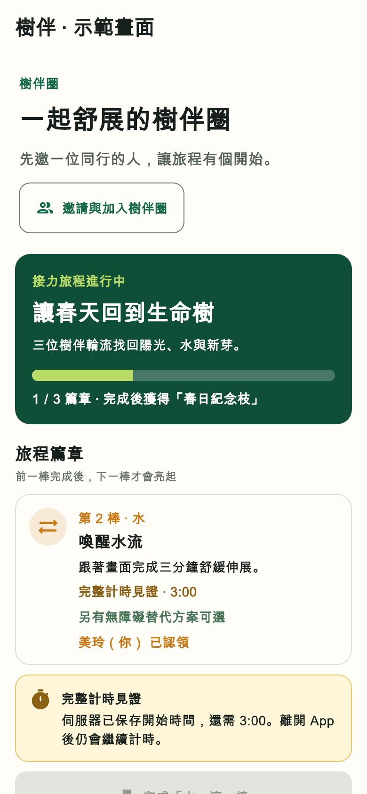
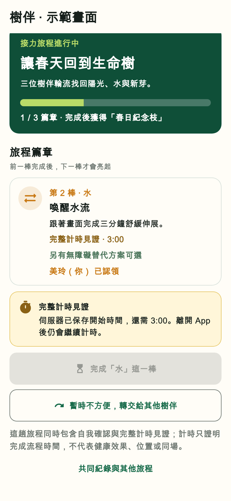

# 接力旅程第二級完整計時見證證據

日期：2026-08-29

追蹤議題：[GitHub #45](https://github.com/z1nnz/elder-tree-esg/issues/45)

合併請求：[GitHub #46](https://github.com/z1nnz/elder-tree-esg/pull/46)

工作分支：`codex/relay-timer-witness`

## 問題與主要負責人決策

「讓春天回到生命樹」第二篇章原本寫著三分鐘舒展或慢呼吸，實際卻和其他篇章一樣只要按下自我確認。這會讓使用者誤以為系統見證了完整流程，也無法支撐分級行動見證的產品主張。

本次由主要負責人 `@z1nnz` 採用下列規則並負責跨端整合與正式版本驗收：

- 認領成功就是伺服器計時起點，不以手機本機時間決定是否完成；
- 一般舒展與無障礙慢呼吸都要求 180 秒，不因替代方案而降低見證強度；
- 未滿時間不建立真實足跡、不交棒、不增加年輪；
- 通過後保存開始時間、最低秒數、實際秒數、完成時間與「完整計時」層級；
- 轉棒重新計時，逾時釋出不沿用舊計時；
- 完整計時只證明流程時間，不宣稱姿勢、位置、同場或健康效果。

架構取捨另見[架構決策 0003](../adr/0003-use-relay-claim-as-timer-start.md)。

## 實作範圍

- 契約：旅程篇章與替代行動回傳最低秒數；完成紀錄回傳計時摘要。
- 資料庫：`CooperativeActionContribution` 保存計時開始、最低秒數與實際經過秒數；遷移限制最低秒數必須為正、經過秒數不得為負，且經過秒數不得小於最低秒數。
- API：在原接力交易與冪等保護內判定完整秒數，最後一毫秒不會被無條件捨去成完成。
- App：篇章卡、方案選擇與接棒提示標示見證強度；倒數期間禁用完成，離開 App 後仍以伺服器開始時間繼續。
- 展示資料：離線示範中的第二篇章同步標示為完整計時，不再把它展示成自我確認。

## 真實 Flutter 畫面

完整頁面先交代圈子、旅程進度、計時篇章與認領狀態，沒有把計時器做成脫離接力玩法的單獨工具。

畫面由 Flutter 測試環境實際渲染；中文字型只在本機截圖時載入，未提交或重新散布。灰色完成按鈕表示時間尚未達標，轉交仍保持可操作。

兩張畫面雜湊分別為 `15a47df713537293f0186d354ef0645e641e9cff9783fea50e9d6e4a328f4122` 與 `c374cc655b4f265e6f7e5cccbd6e89f781302fd6163d39e1a9738087fbe1c12a`。

## 本機驗證

| 驗證 | 結果 |
| --- | --- |
| `npm test --workspace @elder-tree/contracts` | 3 項通過 |
| `npm test --workspace @elder-tree/api` | 33 項通過、51 項需資料庫的案例依設計跳過；其中計時判定 5 項通過，涵蓋 `179.999` 秒、精確邊界與錯誤規則 |
| 契約與 API TypeScript 型別檢查 | 通過 |
| Prisma 結構驗證 | 通過；使用非正式本機連線字串只解析結構，未聲稱執行資料遷移 |
| `flutter analyze --no-pub` | 零問題 |
| 計時模型與畫面專項 | 12 項通過：秒數邊界、倒數阻擋及 360／390／768 寬 × 1／1.5／2 倍文字 |
| Flutter 完整回歸 | 163 項通過，3 項隔離服務案例依設計跳過 |
| Flutter 畫面擷取 | 通過；保存 390 × 844 可核對畫面 |
| Android 除錯版安裝包 | 本機建置通過；247 MB，SHA-256 `776d76996eac3eeec914860e8be4111ccb6700b3ddc80beb3fe321e417213a86` |

本機 PostgreSQL 缺少既有 PostGIS 擴充，完整遷移在進入本功能測試前停止；專用空測試資料庫已刪除。資料庫整合、三個 Flutter HTTP 客戶端、macOS 與 iOS 建置須由本次提交的遠端 CI 重新驗證，不能沿用上一個合併請求結果；Android 僅證明本機除錯版建置，仍不等於實體手機操作通過。

## 尚未證明

- 尚未證明真人會完整做完動作，計時器也無法判斷姿勢或持續活動。
- 尚未完成 Android／iOS 實機背景切換、休眠、系統時間變更與輔助科技驗收。
- 本層級不可用於優惠核銷、志工服務時數、公司永續成果、成樹準備或真實植樹。
- 位置＋停留＋步數、照片、短效碼與合作單位確認仍是後續更高強度見證。
