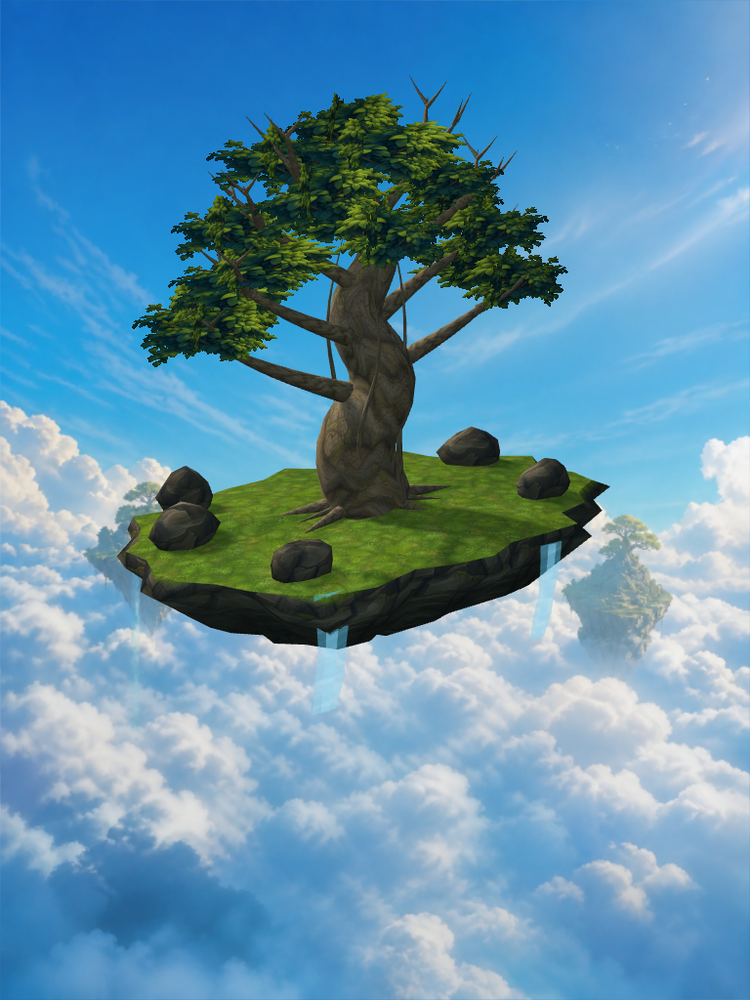
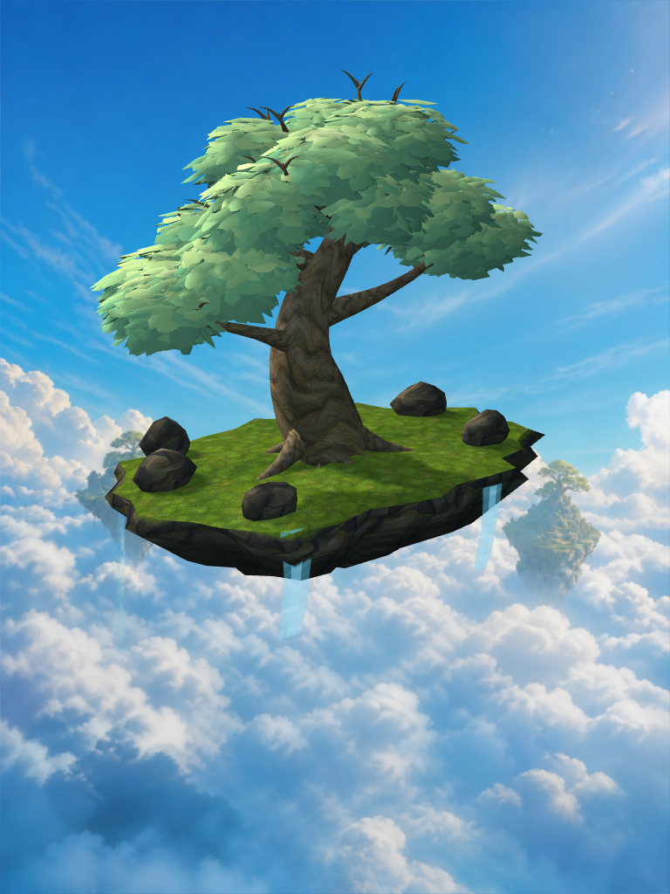
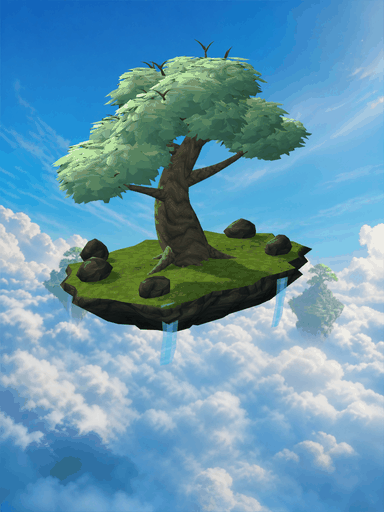

# 生命樹品質迭代｜2026-09-08

本輪先完成既有美術管線與功能回歸，沒有增加新的玩法。工作分支為 `codex/life-tree-floating-world`。

## 可直接檢查的成品







兩張實景使用相同的場景取景規則與成熟階段。模型邊界改變時相機目標會依現有規則調整，不能視為完全鎖定像素的實驗。動態原始輸出為 90 幀，分享檔取隔幀縮至 384 × 512；它驗證畫面確實變化，不是手機幀率測試。

## 本輪改動

- 不對稱枝幹、合攏而保有留白的樹冠、主次根系，移除原先浮在樹幹表面的亮色脊條。
- 葉冠由 48 張交叉透明圖片改成 3,840 片帶主脈起伏的立體葉片；以頂點顏色形成上亮下暗的綠色層次，合併成 16 個樹冠網格。
- Unity 使用不透明、雙面、低光澤的立體葉片材質，支援既有微風時間與降低動態開關。
- 樹幹增加寬幅扭轉起伏，主要根系增加基部體積。8 個主枝、16 個葉冠節點、12 個紀念掛點名稱與識別保持穩定。
- 保留 Blender 母稿、FBX、GLB、實景、資產統計與動態輸出脚本。

模型目前為 38,782 三角面、36,267 頂點、94 個網格物件。這是模型預算，不能代替行動裝置效能量測。立體葉片減少透明裁切與貼圖依賴，同時增加幾何成本；是否更省電須在實機判斷。

## 驗證

- Blender 5.2.1 匯出完成，節點數與三角面預算檢查通過。
- Unity 6000.0.82f1 實景與 90 幀動畫輸出成功。
- Unity 編輯器 11 項測試通過，0 失敗、0 略過；包含立體葉片顏色資料、共用材質、微風、降低動態、紀念掛點與瀑布控制。[測試報告](screenshots/tree-refinement-2026-09-08/Unity測試結果.xml)
- Flutter 182 項測試通過，3 項既有略過；靜態分析無問題。
- 真實 Neon 資料庫完整持久化測試 28／28 通過，耗時約 417 秒。涵蓋三人接力、計時見證、圈別隔離、照片審查流程、探索距離與複合停留／步數見證。照片測試使用受控驗證器替身，並非真實 Gemini 服務或手機拍照驗收。
- 修正預設接力的同時發布排序，使旅程選擇固定；探索測試以當下時間為起點，避免共用資料庫的正常四小時隱私清理工作將歷史日期的測試行程過期。正式隱私保留政策未放寬。

## 還沒有完成的驗收

這一版是已進入 Unity 的美術迭代，仍有主枝接合、浮島草地、岩塊配置、瀑布邊緣與場景風格一致性需要精修。尚未重新打包到實體手機，不能宣稱使用者手機已收到新版，也不能宣稱達到大型商業遊戲最終美術品質。

既有 App 的照片辨識真實模型服務、AI 管家、實機相機／GPS／健康步數與多人連線端到端仍需逐項驗收；本輪的 Flutter 與 Unity 測試不替這些項目背書。待既有流程驗收後，再討論多樣化玩法。

## 重現

```sh
blender --background --python tools/blender/build_life_tree.py -- \
  --output apps/life-tree-unity/Assets/Art/Generated --source art-source/blender
```

Unity 實景與動態指令沿用 `apps/life-tree-unity/README.md`。`tools/unity/package_motion_evidence.py` 將實際捕捉的 90 幀打包為 GIF，檢查幀數與畫面差異，不產生合成場景。
